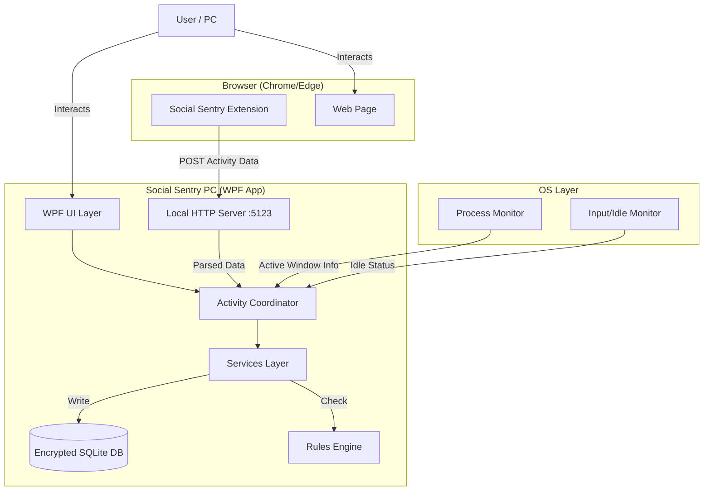

# Social Sentry PC - Product Requirements & Architecture Document

## 1. Product Overview
**App Name:** Social Sentry (PC Version)  
**Platform:** Windows (Native WPF/.NET 8)  
**Core Mission:** A Digital Wellbeing, Parental Control, and Activity Tracking application that operates with a **Zero Trust**, **Offline-First**, and **Private-By-Design** philosophy.

### 1.1 Key Principles
1.  **Zero Trust & Privacy:** All data is encrypted locally. Even if the PC is compromised, the data remains unreadable without the specific application key (managed via DPAPI).
2.  **Offline First:** The application requires NO internet connection for its core logic, database, or reporting. No cloud backups. No data exfiltration.
3.  **Unobtrusive Tracking:** Tracks 100% of user activity (Apps, Browsing via Extension, Screen presence) with minimal system impact.
4.  **Security:** Self-protection mechanisms to prevent unauthorized termination.

---

## 2. Architecture

### 2.1 High-Level Stack
*   **UI Layer:** Windows Presentation Foundation (WPF) with WinUI 3 styling (Modern, Fluent Design).
*   **Target Framework:** .NET 8.0 Windows.
*   **Database:** SQLite (Local). *Requirement: Must use SQLCipher or full-page encryption for Zero Trust conformance.*
*   **Browser Integration:** Browser Extension (Chrome/Edge/Firefox MV3) communicating via Local HTTP Server (`http://localhost:5123`).
*   **Security:** `System.Security.Cryptography` (AES-256) + Windows DPAPI for Key Protection.

### 2.2 System Diagram


---

## 3. Implementation Status & Roadmap

### 3.1 Current State Analysis
*   **Overall Completion:** ~60% (Prototype / Alpha Stage)
*   **Core Logic:** 80%
*   **UI/UX:** 70%
*   **Security/Encryption:** 30% (Critical Gap for "Zero Trust")

### 3.2 Breakdown by Component

| Component | Status | % Done | Notes |
| :--- | :--- | :--- | :--- |
| **Activity Tracker** | 🟢 functional | 90% | Tracks Process, Title, Duration well. |
| **Browser Extension** | 🟡 Partial | 80% | Communication works. Needs robust tab switching & "Back/Forward" tracking logic. |
| **Database** | 🟡 Partial | 70% | Schema exists. **MAJOR GAP: Not fully encrypted at rest (Zero Trust violation).** |
| **Blocking Engine** | 🟡 Partial | 60% | Basic blocking logic exists. Needs "Kill Process" vs "Close Window" refinement. |
| **UI / Dashboard** | 🟡 Partial | 60% | Views exist but placeholders present. Needs "Digital Wellbeing" polish. |
| **Tamper Protection** | 🔴 Early | 20% | Watchdog service folder exists, but robust ACLs/Anti-Kill missing. |

### 3.3 Roadmap

#### 🚀 Immediate Tasks (Phase 1 - The "Security & Core" Fix)
*   [ ] **Implement Full Database Encryption**: Move from standard SQLite to **SQLCipher** (or similar). The `mastersqlalinhere.txt` schema must be applied to an encrypted database.
    *   *Why:* "only the information and the data can be seen and do useful for the only social sentry this PC app 0 trust policy"
*   [ ] **Solidify Extension**: Ensure it survives browser restarts and handles "Incognito" (if allowed policy).
*   [ ] **Anti-Tamper**: Implement `SetProcessACL` or similar to prevent Task Manager killing (if running as Admin).

#### 🛠️ Future Work (Phase 2 - "Digital Wellbeing" Polish)
*   [ ] **Advanced Analytics**: "Productivity Score", "Focus Sessions".
*   [ ] **Category Rules**: Import standard list of 1000+ sites/apps for auto-categorization.
*   [ ] **Parental Features**: Password-protected uninstall/settings access.

---

## 4. Technical Requirements Details

### 4.1 Data & Encryption (Zero Trust)
*   **Requirement:** "All data... save it should be in the encrypted way"
*   **Current Issue:** `ActivityLog` table currently stores plaintext URL/ProcessName.
*   **Solution:** 
    *   Use `Microsoft.Data.Sqlite` with an encryption provider (e.g. SQLCipher).
    *   Master Key generated on install, stored in `%AppData%` using `ProtectedData.Protect` (DPAPI).
    *   DB Connection String: `Data Source=social_sentry.db;Password={DecryptedMasterKey}`.
    *   **Result:** If `social_sentry.db` is stolen, it is garbage data without the specific user's Windows Login context (DPAPI).

### 4.2 Browser Tracking Implementation
*   **Manifest V3**: Mandatory.
*   **No "History" Permission**: Use `tabs` and `activeTab` to track *real-time* usage, not just history file reading (privacy).
*   **Data Structure**:
    ```json
    {
      "url": "https://youtube.com/watch?v=...",
      "title": "Educational Video - YouTube",
      "timestamp": "2024-01-21T...",
      "scrollDepth": 450,
      "activityType": "Active" // vs Idle
    }
    ```

### 4.3 Database Schema (Source of Truth)
*   See `mastersqlalinhere/mastersqlalinhere.txt` for the canonical Schema.
*   **Update Rule:** Any change to code requiring DB change MUST update strictly `mastersqlalinhere.txt` first.

### 4.4 Update & Sync Policy
*   **Git Workflow**: 
    1.  Feature Branch / Change.
    2.  Update `in_details.md` or `PRD.md` if scope changes.
    3.  Commit with detailed message.
    4.  Push to GitHub immediately.
*   **Android Parity Check**: After every major Feature (e.g., Blocking), manual verification against Android logic is required to ensure feature parity (where applicable).

---

## 5. Security & Privacy Model
1.  **No Cloud**: The app never initiates an outbound network connection (except to localhost for extension).
2.  **Local Intelligence**: Categorization happens locally using a pre-downloaded or hardcoded ruleset/database.
3.  **Encrypted Logs**: Detailed logs (URLs, Titles) are encrypted. Aggregated high-level stats (e.g., "Productivity: 2h") *could* be less sensitive, but strictly we encrypt everything.

---
**Document Generated By:** Agentic AI  
**Date:** 2026-01-21
