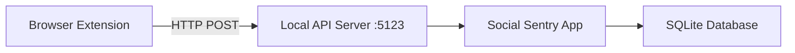

# Browser Extension - Product Requirements Document (PRD)

## Overview
Create a browser extension that tracks detailed user activity and sends real-time data to Social Sentry desktop app.

## Goals
1. Track granular user behavior (scrolling, video watching, studying, doom scrolling)
2. Send real-time activity data to Social Sentry via local API
3. Auto-install extension from Social Sentry Settings

---

## Architecture



---

## Extension Features

### Activity Detection
| Activity | Detection Method |
|----------|------------------|
| Video Watching | `<video>` element playing state, YouTube/Netflix player |
| Reels/Shorts | URL patterns (/shorts, /reels), vertical video player |
| Scrolling Feed | Scroll velocity + content type analysis |
| Reading/Studying | Low scroll speed + text-heavy content + time on page |
| Idle | No mouse/keyboard activity for 30+ seconds |
| Active Typing | Keyboard input detection |

### Tracked Data
- Current URL and page title
- Activity type (video, scrolling, studying, idle)
- Time spent on activity
- Scroll depth percentage
- Video watch duration
- Tab focus/blur events

---

## Technical Implementation

### Extension Structure
```
extension/
├── manifest.json          # Chrome Manifest V3
├── background.js          # Service worker
├── content.js             # Page activity tracker
├── popup.html             # Extension popup UI
├── popup.js               # Popup logic
├── icons/                 # Extension icons
└── styles.css             # Popup styles
```

### API Endpoints (Local Server)
| Endpoint | Method | Description |
|----------|--------|-------------|
| `/api/activity` | POST | Send activity data |
| `/api/heartbeat` | GET | Check connection |
| `/api/config` | GET | Get tracking settings |

### Data Format
```json
{
  "timestamp": "2026-01-21T06:45:00Z",
  "url": "https://youtube.com/watch?v=xxx",
  "title": "Video Title",
  "activityType": "video_watching",
  "duration": 120,
  "metadata": {
    "videoProgress": 0.45,
    "scrollDepth": 0
  }
}
```

---

## Auto-Install Mechanism

> [!IMPORTANT]
> Chrome extensions cannot be silently installed. The best approach is:
> 1. Open browser to chrome://extensions with extension folder path
> 2. Guide user through "Load unpacked" process
> 3. OR distribute via Chrome Web Store (requires review)

### Proposed Flow
1. User clicks "Install" in Social Sentry Settings
2. App copies extension files to a known location
3. App opens browser with instructions
4. User enables Developer Mode and loads unpacked extension

---

## Desktop App Changes

### New Components
1. **Local HTTP Server** - Listen on port 5123 for extension data
2. **Extension Manager** - Handle install/uninstall
3. **Real-time Activity View** - Display current activity from extension

### Settings UI Updates
- Add "Install" button per browser
- Show connection status (Connected/Disconnected)
- Show real-time activity indicator

---

## Verification Plan

### Extension Testing
- [ ] Extension loads without errors
- [ ] Activity detection works for video/scrolling/studying
- [ ] Data sent successfully to local API

### Integration Testing
- [ ] Social Sentry receives extension data
- [ ] Real-time activity displays correctly
- [ ] Install flow works for Chrome/Edge/Brave

---

## Risks & Limitations
1. **No silent install** - Browser security prevents auto-install
2. **Manifest V3** - Service workers have 5-minute timeout
3. **Cross-browser** - Firefox uses different manifest format
